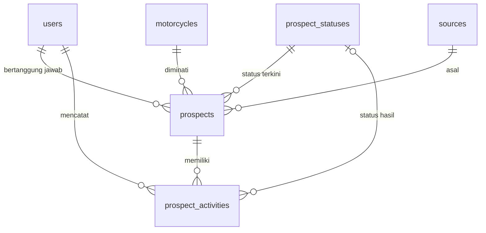

# Spesifikasi Struktur Database — SIMPRO

**Sistem Informasi Monitoring Prospek · DBMS: MySQL · Framework: Laravel 10**

---

## 1. Ringkasan Database

### 1.1 Tujuan Perancangan

Database SIMPRO dirancang untuk menyimpan dan memonitor data prospek konsumen dealer sepeda motor, termasuk riwayat aktivitas follow-up melalui **Phone** dan **Visit**. Prinsip perancangan:

- **Minimal namun efektif:** hanya 7 tabel, tanpa tabel perantara yang tidak diperlukan.
- **Normal (minimal 3NF):** data referensi (motor, sumber, status) dipisah menjadi tabel master sehingga tidak ada nilai teks berulang di tabel transaksi.
- **Riwayat tanpa redundansi:** setiap aktivitas follow-up disimpan sebagai **baris baru** di `prospect_activities` (append-only). Aktivitas lama tidak pernah ditimpa. Status terkini prospek disimpan di `prospects`, sedangkan histori perubahan status terekam pada aktivitas terkait.
- **Aman:** referential integrity melalui foreign key, hashing password, soft delete untuk data prospek, dan pembatasan hak akses lewat kolom `role`.
- **Konvensi penamaan:** `snake_case`, nama tabel **jamak (plural)**, primary key `id`, foreign key `<singular>_id`, sesuai standar Laravel.

### 1.2 Daftar Tabel

1. `users`
2. `motorcycles`
3. `sources`
4. `prospect_statuses`
5. `prospects`
6. `prospect_activities`
7. `notifications`

**Total: 7 tabel aplikasi.**

> Tabel bawaan framework Laravel (`migrations`, `password_reset_tokens`, `sessions`, `failed_jobs`, `personal_access_tokens`) dibuat otomatis oleh Laravel bila dibutuhkan dan tidak dihitung dalam total di atas.

---

## 2. Spesifikasi Detail Tabel

### 2.1 Tabel `users`

Menyimpan akun pengguna sistem (Sales dan Admin).

| Field | Type | Keterangan / Constraint |
|---|---|---|
| `id` | BIGINT UNSIGNED | **PK**, AUTO_INCREMENT |
| `name` | VARCHAR(100) | NOT NULL |
| `email` | VARCHAR(150) | NOT NULL, **UNIQUE**; dipakai sebagai username login |
| `password` | VARCHAR(255) | NOT NULL; hasil hash bcrypt/argon2 |
| `role` | ENUM('admin','sales') | NOT NULL, DEFAULT `'sales'` |
| `is_active` | TINYINT(1) | NOT NULL, DEFAULT `1`; `0` = akun dinonaktifkan |
| `remember_token` | VARCHAR(100) | NULL |
| `created_at` | TIMESTAMP | NULL |
| `updated_at` | TIMESTAMP | NULL |

**Definisi nilai data**

| Field | Nilai valid | Arti |
|---|---|---|
| `role` | `admin` | Mengelola master data, pengguna, dan memonitor seluruh prospek/aktivitas |
| `role` | `sales` | Mengelola prospek miliknya dan mencatat aktivitas Phone/Visit |
| `is_active` | `1` / `0` | Aktif / Nonaktif (tidak dapat login) |

**Aturan khusus**
- Akun tidak dihapus permanen bila sudah memiliki prospek atau aktivitas; gunakan `is_active = 0`.
- Hanya `role = 'sales'` yang boleh menjadi penanggung jawab prospek (`prospects.user_id`), divalidasi di level aplikasi.

---

### 2.2 Tabel `motorcycles`

Master data motor yang diminati prospek.

| Field | Type | Keterangan / Constraint |
|---|---|---|
| `id` | BIGINT UNSIGNED | **PK**, AUTO_INCREMENT |
| `brand` | VARCHAR(50) | NOT NULL |
| `name` | VARCHAR(100) | NOT NULL; nama model/tipe motor |
| `is_active` | TINYINT(1) | NOT NULL, DEFAULT `1` |
| `created_at` | TIMESTAMP | NULL |
| `updated_at` | TIMESTAMP | NULL |

**Aturan khusus**
- Kombinasi (`brand`, `name`) bersifat **UNIQUE** agar tidak ada motor ganda.
- Motor yang sudah dipakai prospek tidak dihapus; nonaktifkan dengan `is_active = 0`.

---

### 2.3 Tabel `sources`

Master data sumber prospek (mis. Walk-in, Pameran, Media Sosial, Referensi).

| Field | Type | Keterangan / Constraint |
|---|---|---|
| `id` | BIGINT UNSIGNED | **PK**, AUTO_INCREMENT |
| `name` | VARCHAR(50) | NOT NULL, **UNIQUE** |
| `is_active` | TINYINT(1) | NOT NULL, DEFAULT `1` |
| `created_at` | TIMESTAMP | NULL |
| `updated_at` | TIMESTAMP | NULL |

---

### 2.4 Tabel `prospect_statuses`

Master data status perkembangan prospek.

| Field | Type | Keterangan / Constraint |
|---|---|---|
| `id` | BIGINT UNSIGNED | **PK**, AUTO_INCREMENT |
| `code` | VARCHAR(30) | NOT NULL, **UNIQUE**; slug stabil untuk kode aplikasi & pemetaan warna UI |
| `name` | VARCHAR(50) | NOT NULL; label tampilan |
| `sort_order` | TINYINT UNSIGNED | NOT NULL, DEFAULT `0`; urutan tahapan pada Status Tracker |
| `is_final` | TINYINT(1) | NOT NULL, DEFAULT `0`; `1` = status akhir (Deal / Batal) |
| `created_at` | TIMESTAMP | NULL |
| `updated_at` | TIMESTAMP | NULL |

**Data awal (seeder) yang disarankan**

| `sort_order` | `code` | `name` | `is_final` |
|---|---|---|---|
| 1 | `baru` | Baru | 0 |
| 2 | `follow_up` | Follow-up | 0 |
| 3 | `hot` | Hot | 0 |
| 4 | `deal` | Deal | 1 |
| 5 | `batal` | Batal | 1 |

**Aturan khusus**
- Warna badge **tidak** disimpan di database; dipetakan di frontend berdasarkan `code` agar tidak ada data presentasi di tabel.
- Status dengan `is_final = 1` tidak dapat diubah kembali oleh Sales (validasi aplikasi); hanya Admin.

---

### 2.5 Tabel `prospects`

Data utama calon konsumen. Menyimpan **status terkini** prospek.

| Field | Type | Keterangan / Constraint |
|---|---|---|
| `id` | BIGINT UNSIGNED | **PK**, AUTO_INCREMENT |
| `user_id` | BIGINT UNSIGNED | NOT NULL, **FK → `users.id`**; sales penanggung jawab |
| `motorcycle_id` | BIGINT UNSIGNED | NOT NULL, **FK → `motorcycles.id`** |
| `source_id` | BIGINT UNSIGNED | NOT NULL, **FK → `sources.id`** |
| `prospect_status_id` | BIGINT UNSIGNED | NOT NULL, **FK → `prospect_statuses.id`**; status terkini |
| `name` | VARCHAR(100) | NOT NULL; nama calon konsumen |
| `phone` | VARCHAR(20) | NOT NULL; nomor telepon/WhatsApp |
| `email` | VARCHAR(150) | NULL |
| `address` | TEXT | NULL |
| `notes` | TEXT | NULL; catatan umum prospek |
| `created_at` | TIMESTAMP | NULL |
| `updated_at` | TIMESTAMP | NULL |
| `deleted_at` | TIMESTAMP | NULL; **soft delete** |

**Aturan khusus**
- Setiap prospek **wajib** memiliki sales penanggung jawab (`user_id NOT NULL`).
- Nomor telepon disimpan sebagai **string** (bukan angka) agar angka 0 di depan dan tanda `+` tidak hilang.
- Bila `prospect_status_id` diubah, sistem otomatis membuat baris aktivitas yang mencatat perubahan tersebut (lihat 2.6).
- Penghapusan memakai soft delete sehingga riwayat aktivitas tetap utuh.

---

### 2.6 Tabel `prospect_activities`

Riwayat aktivitas follow-up (Phone dan Visit). Bersifat **append-only**.

| Field | Type | Keterangan / Constraint |
|---|---|---|
| `id` | BIGINT UNSIGNED | **PK**, AUTO_INCREMENT |
| `prospect_id` | BIGINT UNSIGNED | NOT NULL, **FK → `prospects.id`** |
| `user_id` | BIGINT UNSIGNED | NOT NULL, **FK → `users.id`**; pengguna yang mencatat |
| `prospect_status_id` | BIGINT UNSIGNED | NULL, **FK → `prospect_statuses.id`**; status prospek **setelah** aktivitas ini (NULL bila tidak berubah) |
| `type` | ENUM('phone','visit') | NOT NULL |
| `activity_at` | DATETIME | NOT NULL; waktu aktivitas terjadi |
| `notes` | TEXT | NOT NULL; hasil/catatan follow-up |
| `created_at` | TIMESTAMP | NULL |
| `updated_at` | TIMESTAMP | NULL |

**Definisi nilai data**

| Field | Nilai valid | Arti |
|---|---|---|
| `type` | `phone` | Follow-up melalui telepon |
| `type` | `visit` | Follow-up melalui kunjungan |

**Aturan khusus**
- Aktivitas **tidak boleh diubah atau dihapus** lewat aplikasi; koreksi dilakukan dengan menambah aktivitas baru (memenuhi aturan bisnis "data aktivitas sebelumnya tetap tersimpan").
- Satu prospek dapat memiliki banyak aktivitas (relasi 1:N).
- `prospect_status_id` di tabel ini bukan duplikasi: ia merekam **kapan** status berubah (histori), sedangkan `prospects.prospect_status_id` menyimpan **status saat ini**.
- `activity_at` tidak boleh melewati waktu saat ini (validasi aplikasi).

---

### 2.7 Tabel `notifications`

Notifikasi internal, mengikuti struktur standar Laravel Notifications (`php artisan notifications:table`).

| Field | Type | Keterangan / Constraint |
|---|---|---|
| `id` | CHAR(36) | **PK**, UUID |
| `type` | VARCHAR(255) | NOT NULL; nama kelas notifikasi |
| `notifiable_type` | VARCHAR(255) | NOT NULL; polimorfik, bernilai `App\Models\User` |
| `notifiable_id` | BIGINT UNSIGNED | NOT NULL; ID `users` penerima |
| `data` | TEXT (JSON) | NOT NULL; isi notifikasi (mis. `prospect_id`, pesan) |
| `read_at` | TIMESTAMP | NULL; NULL = belum dibaca |
| `created_at` | TIMESTAMP | NULL |
| `updated_at` | TIMESTAMP | NULL |

**Aturan khusus**
- Tabel ini memakai relasi polimorfik bawaan Laravel sehingga **tidak memiliki FK fisik**; integritas dijaga oleh framework.
- Notifikasi yang sudah dibaca dapat dibersihkan berkala (mis. > 90 hari) lewat scheduled command.
- Bila notifikasi belum dipakai pada versi awal, migrasinya boleh ditunda tanpa memengaruhi tabel lain.

---

## 3. Pemetaan Relasi Antar Tabel

```
MASTER DATA
├── users (1) ─────────────< prospects (N)            [prospects.user_id → sales penanggung jawab]
├── users (1) ─────────────< prospect_activities (N)  [prospect_activities.user_id → pencatat aktivitas]
├── users (1) ─────────────< notifications (N)        [polimorfik: notifiable_id → penerima]
├── motorcycles (1) ───────< prospects (N)            [prospects.motorcycle_id]
├── sources (1) ───────────< prospects (N)            [prospects.source_id]
└── prospect_statuses (1)
    ├──────────────────────< prospects (N)            [prospects.prospect_status_id → status terkini]
    └──────────────────────< prospect_activities (N)  [prospect_activities.prospect_status_id → status hasil aktivitas]

TRANSAKSI
└── prospects (1)
    └───────────────────────< prospect_activities (N) [prospect_activities.prospect_id]
```

Ringkasan kardinalitas:

| Parent | Child | Kardinalitas | Perilaku hapus (FK) |
|---|---|---|---|
| `users` | `prospects` | 1 : N | RESTRICT |
| `users` | `prospect_activities` | 1 : N | RESTRICT |
| `motorcycles` | `prospects` | 1 : N | RESTRICT |
| `sources` | `prospects` | 1 : N | RESTRICT |
| `prospect_statuses` | `prospects` | 1 : N | RESTRICT |
| `prospect_statuses` | `prospect_activities` | 1 : N (opsional) | RESTRICT |
| `prospects` | `prospect_activities` | 1 : N | RESTRICT |



---

## 4. Implementasi Migration (Laravel 10)

**Urutan pembuatan migrasi** (tabel parent lebih dulu): `users` → `motorcycles` → `sources` → `prospect_statuses` → `prospects` → `prospect_activities` → `notifications`.

### 4.1 `users`

```php
<?php

use Illuminate\Database\Migrations\Migration;
use Illuminate\Database\Schema\Blueprint;
use Illuminate\Support\Facades\Schema;

return new class extends Migration
{
    public function up(): void
    {
        Schema::create('users', function (Blueprint $table) {
            $table->id();
            $table->string('name', 100);
            $table->string('email', 150)->unique();
            $table->string('password');
            $table->enum('role', ['admin', 'sales'])->default('sales');
            $table->boolean('is_active')->default(true);
            $table->rememberToken();
            $table->timestamps();

            $table->index(['role', 'is_active']);
        });
    }

    public function down(): void
    {
        Schema::dropIfExists('users');
    }
};
```

### 4.2 `prospect_statuses`

```php
<?php

use Illuminate\Database\Migrations\Migration;
use Illuminate\Database\Schema\Blueprint;
use Illuminate\Support\Facades\Schema;

return new class extends Migration
{
    public function up(): void
    {
        Schema::create('prospect_statuses', function (Blueprint $table) {
            $table->id();
            $table->string('code', 30)->unique();
            $table->string('name', 50);
            $table->unsignedTinyInteger('sort_order')->default(0);
            $table->boolean('is_final')->default(false);
            $table->timestamps();
        });
    }

    public function down(): void
    {
        Schema::dropIfExists('prospect_statuses');
    }
};
```

### 4.3 `prospects`

```php
<?php

use Illuminate\Database\Migrations\Migration;
use Illuminate\Database\Schema\Blueprint;
use Illuminate\Support\Facades\Schema;

return new class extends Migration
{
    public function up(): void
    {
        Schema::create('prospects', function (Blueprint $table) {
            $table->id();
            $table->foreignId('user_id')->constrained('users')->restrictOnDelete();
            $table->foreignId('motorcycle_id')->constrained('motorcycles')->restrictOnDelete();
            $table->foreignId('source_id')->constrained('sources')->restrictOnDelete();
            $table->foreignId('prospect_status_id')->constrained('prospect_statuses')->restrictOnDelete();

            $table->string('name', 100);
            $table->string('phone', 20);
            $table->string('email', 150)->nullable();
            $table->text('address')->nullable();
            $table->text('notes')->nullable();

            $table->timestamps();
            $table->softDeletes();

            // Indeks untuk daftar & monitoring
            $table->index(['user_id', 'prospect_status_id']);
            $table->index('prospect_status_id');
            $table->index('created_at');
            $table->index('name');
            $table->index('phone');
        });
    }

    public function down(): void
    {
        Schema::dropIfExists('prospects');
    }
};
```

### 4.4 `prospect_activities`

```php
<?php

use Illuminate\Database\Migrations\Migration;
use Illuminate\Database\Schema\Blueprint;
use Illuminate\Support\Facades\Schema;

return new class extends Migration
{
    public function up(): void
    {
        Schema::create('prospect_activities', function (Blueprint $table) {
            $table->id();
            $table->foreignId('prospect_id')->constrained('prospects')->restrictOnDelete();
            $table->foreignId('user_id')->constrained('users')->restrictOnDelete();
            $table->foreignId('prospect_status_id')->nullable()
                  ->constrained('prospect_statuses')->restrictOnDelete();

            $table->enum('type', ['phone', 'visit']);
            $table->dateTime('activity_at');
            $table->text('notes');

            $table->timestamps();

            // Riwayat per prospek (urut waktu) & monitoring admin
            $table->index(['prospect_id', 'activity_at']);
            $table->index(['type', 'activity_at']);
            $table->index(['user_id', 'activity_at']);
        });
    }

    public function down(): void
    {
        Schema::dropIfExists('prospect_activities');
    }
};
```

> Tabel `motorcycles` dan `sources` mengikuti pola yang sama dengan `prospect_statuses` (lihat kamus data pada 2.2 dan 2.3). Untuk `motorcycles` tambahkan `$table->unique(['brand', 'name']);`.

---

## 5. Rekomendasi Optimasi & Keamanan

### 5.1 Indeks

| Tabel | Indeks | Tujuan |
|---|---|---|
| `users` | `UNIQUE(email)` | Login cepat dan mencegah email ganda |
| `users` | `INDEX(role, is_active)` | Filter daftar sales aktif |
| `prospects` | `INDEX(user_id, prospect_status_id)` *(composite)* | Daftar "Prospek Saya" per status untuk Sales |
| `prospects` | `INDEX(prospect_status_id)` | Rekap dashboard per status |
| `prospects` | `INDEX(created_at)` | Filter/urut berdasarkan tanggal masuk |
| `prospects` | `INDEX(name)`, `INDEX(phone)` | Pencarian prospek |
| `prospect_activities` | `INDEX(prospect_id, activity_at)` *(composite)* | Timeline riwayat per prospek (query paling sering) |
| `prospect_activities` | `INDEX(type, activity_at)` | Rekap Phone vs Visit per periode |
| `prospect_activities` | `INDEX(user_id, activity_at)` | Monitoring aktivitas per sales |
| `notifications` | `INDEX(notifiable_type, notifiable_id)` | Notifikasi per pengguna (dibuat otomatis oleh `morphs`) |
| Semua FK | Otomatis terindeks | Laravel `foreignId()->constrained()` membuat indeks FK |

Catatan: pencarian `LIKE '%kata%'` tidak memanfaatkan indeks B-Tree biasa. Bila data membesar, pertimbangkan `FULLTEXT` pada `prospects.name` atau pencarian awalan (`LIKE 'kata%'`).

### 5.2 Keamanan & Best Practices

1. **Password:** simpan hasil hash (`Hash::make`, bcrypt atau argon2), kolom `VARCHAR(255)`. Jangan pernah menyimpan atau mencatat password mentah.
2. **Hak akses:** cek `role` dan kepemilikan (`prospects.user_id`) pada setiap query lewat Policy/Gate. Sales hanya boleh mengakses prospek miliknya.
3. **Integritas data:** seluruh FK memakai `RESTRICT` sehingga data referensi tidak hilang tanpa sengaja; gunakan `is_active` dan soft delete alih-alih hard delete.
4. **Riwayat tak terubah:** batasi operasi `UPDATE`/`DELETE` pada `prospect_activities` di level aplikasi. Untuk ketat, gunakan user database aplikasi tanpa hak `DELETE` pada tabel ini.
5. **Transaksi:** saat menyimpan aktivitas yang mengubah status, jalankan dalam satu `DB::transaction()` agar `prospects` dan `prospect_activities` selalu konsisten.
6. **Least privilege:** user MySQL aplikasi hanya diberi `SELECT, INSERT, UPDATE, DELETE` pada database SIMPRO, bukan `root`/`DROP`/`ALTER`.
7. **Data pribadi:** `phone`, `email`, dan `address` adalah data pribadi konsumen. Batasi tampilannya, jangan tulis ke log aplikasi, dan pertimbangkan `encrypted` cast Laravel bila kebijakan dealer mewajibkan (konsekuensinya kolom tersebut tidak bisa dicari langsung dengan `LIKE`).
8. **Tipe data tepat:** nomor telepon sebagai `VARCHAR`, waktu sebagai `DATETIME`/`TIMESTAMP`, flag sebagai `TINYINT(1)`, nilai terbatas sebagai `ENUM`. Bila kelak lokasi Visit ingin disimpan sebagai koordinat, gunakan `DECIMAL(10,7)` untuk `latitude` dan `longitude` (bukan FLOAT), atau tipe `POINT` dengan indeks spasial.
9. **Charset & engine:** gunakan `utf8mb4` / `utf8mb4_unicode_ci` dan engine `InnoDB` (mendukung FK dan transaksi).
10. **Backup:** jadwalkan backup database harian (mis. `mysqldump` atau paket `spatie/laravel-backup`), simpan di lokasi terpisah, dan uji restore secara berkala.
11. **Validasi berlapis:** validasi di Form Request Laravel dan pertahankan constraint database (`NOT NULL`, `UNIQUE`, `ENUM`, FK) sebagai lapisan pertahanan terakhir.
