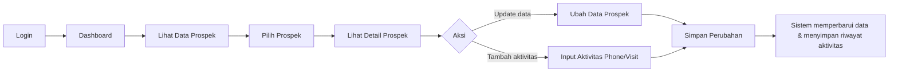
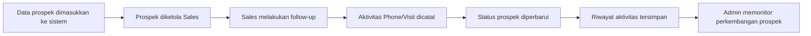
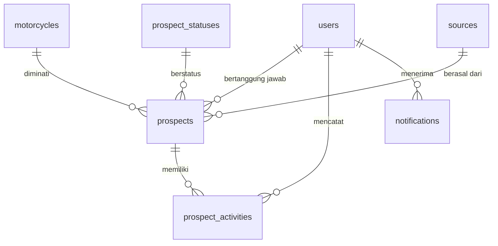

# Product Requirement Document (PRD)

## SIMPRO — Sistem Informasi Monitoring Prospek

| Item | Keterangan |
|---|---|
| **Nama Produk** | SIMPRO (Sistem Informasi Monitoring Prospek) |
| **Jenis Platform** | Responsive Website |
| **Framework** | Laravel 10 |
| **Database** | MySQL |
| **Pengguna Target** | Sales dan Admin dealer sepeda motor |
| **Status Dokumen** | Draft v1.0 |

---

## 1. Gambaran Umum Produk

### 1.1 Latar Belakang
SIMPRO merupakan sistem informasi berbasis web yang digunakan untuk membantu dealer sepeda motor dalam mengelola dan memonitor data prospek konsumen. Sistem ini mencatat data prospek serta memungkinkan data prospek diperbarui berdasarkan aktivitas follow-up melalui **Phone** dan **Visit**.

### 1.2 Pernyataan Masalah
1. Pengelolaan data prospek konsumen belum terpusat dalam satu sistem.
2. Proses monitoring perkembangan prospek masih kurang terstruktur.
3. Riwayat follow-up melalui Phone dan Visit perlu dicatat agar perkembangan setiap prospek dapat dipantau.

### 1.3 Tujuan Produk
Membantu proses pengelolaan dan monitoring data prospek konsumen secara lebih terstruktur melalui sistem berbasis web, serta memudahkan pencatatan dan pembaruan aktivitas Phone dan Visit.

### 1.4 Target Pengguna
Sales dan Admin dealer sepeda motor.

---

## 2. Peran Pengguna (User Roles) & User Stories

### 2.1 Peran Pengguna

| Role | Deskripsi |
|---|---|
| **Sales** | Mengelola data prospek konsumen dan melakukan pembaruan aktivitas prospek melalui Phone dan Visit. |
| **Admin** | Mengelola dan memonitor data prospek serta aktivitas yang dilakukan oleh sales. |

### 2.2 User Stories

#### Sales

| ID | User Story |
|---|---|
| US-S01 | Sebagai Sales, saya ingin **menambahkan data prospek** konsumen sehingga data calon konsumen dapat tersimpan dalam sistem. |
| US-S02 | Sebagai Sales, saya ingin **melihat data prospek** sehingga dapat mengetahui daftar calon konsumen yang sedang ditangani. |
| US-S03 | Sebagai Sales, saya ingin **memperbarui data prospek** sehingga informasi calon konsumen tetap sesuai dengan kondisi terbaru. |
| US-S04 | Sebagai Sales, saya ingin **mencatat aktivitas Phone** sehingga riwayat komunikasi dengan konsumen dapat terdokumentasi. |
| US-S05 | Sebagai Sales, saya ingin **mencatat aktivitas Visit** sehingga riwayat kunjungan kepada konsumen dapat terdokumentasi. |
| US-S06 | Sebagai Sales, saya ingin **melihat riwayat aktivitas prospek** sehingga dapat mengetahui perkembangan setiap prospek. |

#### Admin

| ID | User Story |
|---|---|
| US-A01 | Sebagai Admin, saya ingin **melihat data prospek** sehingga dapat melakukan monitoring terhadap data calon konsumen. |
| US-A02 | Sebagai Admin, saya ingin **melihat aktivitas Phone dan Visit** sehingga dapat memonitor proses follow-up prospek. |
| US-A03 | Sebagai Admin, saya ingin **melihat perkembangan status prospek** sehingga dapat mengetahui kondisi prospek yang sedang berjalan. |

---

## 3. Ruang Lingkup (Scope of Work)

### 3.1 In-Scope
- Login pengguna
- Pengelolaan data prospek konsumen
- Pengelolaan data motor
- Pengelolaan sumber prospek
- Pengelolaan status prospek
- Pencatatan aktivitas Phone
- Pencatatan aktivitas Visit
- Pembaruan data prospek
- Riwayat aktivitas prospek
- Monitoring data prospek
- Dashboard monitoring

### 3.2 Out-of-Scope
Fitur yang tidak berkaitan langsung dengan pengelolaan dan monitoring prospek konsumen pada versi awal sistem.

---

## 4. Kebutuhan Sistem

### 4.1 Kebutuhan Fungsional

| ID | Kebutuhan | Deskripsi Singkat |
|---|---|---|
| FR-01 | Sistem login | Autentikasi pengguna menggunakan akun terdaftar. |
| FR-02 | Pengelolaan pengguna | Pengelolaan akun Sales dan Admin. |
| FR-03 | Pengelolaan data prospek | Tambah, lihat, ubah data prospek konsumen. |
| FR-04 | Pengelolaan data motor | Pengelolaan master data motor yang diminati prospek. |
| FR-05 | Pengelolaan sumber prospek | Pengelolaan master data asal prospek. |
| FR-06 | Pengelolaan status prospek | Pengelolaan master data status prospek. |
| FR-07 | Pencatatan aktivitas Phone dan Visit | Pencatatan aktivitas follow-up per prospek. |
| FR-08 | Pembaruan data prospek | Pembaruan informasi dan status prospek. |
| FR-09 | Riwayat aktivitas prospek | Menampilkan seluruh aktivitas follow-up per prospek. |
| FR-10 | Monitoring data prospek | Monitoring prospek dan aktivitas melalui dashboard. |

### 4.2 Kebutuhan Non-Fungsional

| ID | Kebutuhan | Deskripsi |
|---|---|---|
| NFR-01 | Teknologi | Menggunakan Laravel 10 dan database MySQL. |
| NFR-02 | Autentikasi | Sistem memiliki autentikasi pengguna. |
| NFR-03 | Otorisasi | Pembatasan akses berdasarkan role (Sales dan Admin). |
| NFR-04 | Validasi data | Seluruh input divalidasi di sisi server. |
| NFR-05 | Keamanan password | Password disimpan dalam bentuk hash. |
| NFR-06 | Responsive design | Dapat digunakan melalui desktop maupun perangkat mobile. |
| NFR-07 | Struktur database | Struktur database terorganisir dengan relasi yang jelas. |

---

## 5. Aturan Bisnis (Business Rules)

| ID | Aturan |
|---|---|
| BR-01 | Setiap pengguna harus melakukan login untuk mengakses sistem. |
| BR-02 | Setiap prospek memiliki sales yang bertanggung jawab. |
| BR-03 | Data prospek dapat diperbarui oleh pengguna yang memiliki hak akses. |
| BR-04 | Setiap prospek dapat memiliki aktivitas Phone dan Visit. |
| BR-05 | Aktivitas Phone dan Visit dicatat sebagai riwayat aktivitas prospek. |
| BR-06 | Status prospek dapat diperbarui sesuai dengan perkembangan prospek. |
| BR-07 | Data aktivitas sebelumnya tetap tersimpan ketika terdapat aktivitas baru. |
| BR-08 | Data prospek dapat memiliki lebih dari satu aktivitas follow-up. |

---

## 6. Alur & Proses

### 6.1 User Flow



Pengguna login → masuk ke dashboard → melihat data prospek → memilih prospek → melihat detail prospek → melakukan update data atau menambahkan aktivitas Phone/Visit → menyimpan perubahan → sistem memperbarui data dan menyimpan riwayat aktivitas.

### 6.2 Business Process Flow



---

## 7. Kriteria Penerimaan (Acceptance Criteria)

### 7.1 Fitur Tambah Prospek
- **Given:** Sales telah login ke sistem.
- **When:** Sales mengisi data prospek dan menyimpan data.
- **Then:** Sistem menyimpan data prospek dan menampilkannya pada daftar prospek.

### 7.2 Fitur Update Prospek
- **Given:** Data prospek telah tersedia.
- **When:** Sales melakukan perubahan data dan menyimpannya.
- **Then:** Sistem memperbarui data prospek.

### 7.3 Fitur Phone
- **Given:** Prospek telah tersedia.
- **When:** Sales menambahkan aktivitas Phone.
- **Then:** Sistem menyimpan aktivitas Phone sebagai riwayat prospek.

### 7.4 Fitur Visit
- **Given:** Prospek telah tersedia.
- **When:** Sales menambahkan aktivitas Visit.
- **Then:** Sistem menyimpan aktivitas Visit sebagai riwayat prospek.

---

## 8. Arsitektur Data & Tech Stack

### 8.1 Gambaran Database

Tabel utama: `users`, `prospects`, `prospect_activities`, `motorcycles`, `prospect_statuses`, `sources`, dan `notifications`.

- Tabel `prospects` berelasi dengan `users`, `motorcycles`, `prospect_statuses`, dan `sources`.
- Tabel `prospect_activities` menyimpan riwayat aktivitas Phone dan Visit dari setiap prospek.



### 8.2 Gambaran API

| Endpoint (Gambaran) | Fungsi |
|---|---|
| Login pengguna | Autentikasi pengguna. |
| Pengelolaan data prospek | Tambah, lihat, dan ubah data prospek. |
| Detail prospek | Melihat detail prospek beserta riwayat aktivitas. |
| Tambah aktivitas Phone/Visit | Menyimpan aktivitas follow-up prospek. |
| Update status prospek | Memperbarui status perkembangan prospek. |

### 8.3 Tech Stack

| Layer | Teknologi |
|---|---|
| Frontend | Blade Template, HTML, CSS, JavaScript |
| Backend | Laravel 10 |
| Database | MySQL |
| Hosting/Cloud | Hosting yang mendukung Laravel 10 dan MySQL |

### 8.4 Struktur Proyek
Menggunakan struktur standar Laravel 10:

```
simpro/
├── app/          # Model, Controller, Middleware, Request
├── database/     # Migration, Seeder, Factory
├── resources/    # Blade views, CSS, JS
├── routes/       # web.php, api.php
├── public/       # Entry point & aset publik
└── storage/      # Log, cache, file upload
```

---

## 9. Asumsi, Batasan, & Risiko

### 9.1 Asumsi
- Pengguna memiliki akun untuk mengakses sistem.
- Data prospek yang dimasukkan ke dalam sistem merupakan data yang berasal dari aktivitas dealer.

### 9.2 Batasan Sistem
Sistem difokuskan pada pengelolaan dan monitoring prospek konsumen serta aktivitas Phone dan Visit.

### 9.3 Risiko & Mitigasi

| Risiko | Mitigasi |
|---|---|
| Kesalahan input data | Validasi input. |
| Keamanan akun pengguna | Autentikasi pengguna, pengaturan hak akses, hashing password. |
| Kehilangan data | Backup database. |

---

## 10. Pengembangan di Masa Depan (Future Enhancements)

- Pengembangan dashboard monitoring yang lebih lengkap.
- Penambahan laporan perkembangan prospek.
- Penambahan notifikasi follow-up.
- Pengembangan fitur pencarian dan filter prospek yang lebih lengkap.
- Pengembangan integrasi dengan sistem lain yang digunakan oleh dealer.

---

## 11. Lampiran

**Catatan tambahan:** Sistem SIMPRO dirancang untuk membantu proses pengelolaan dan monitoring data prospek konsumen pada dealer sepeda motor. Aktivitas Phone dan Visit menjadi bagian dari proses follow-up sehingga setiap perkembangan prospek dapat tercatat dan dipantau melalui sistem.
